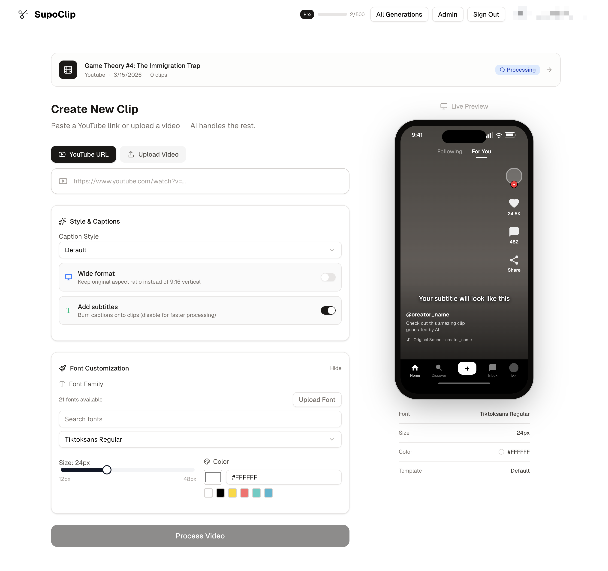

# ViraClip

**AI-Powered Video Clipping for Content Creators**

<p align="center">
  <a href="https://www.viraclip.com">
    
  </a>
</p>

Transform long-form content into viral short clips with AI. ViraClip is an open-source video clipping platform that helps creators repurpose their content for TikTok, Instagram Reels, and YouTube Shorts.

> 💡 **Inspired by SupoClip** - ViraClip builds upon the foundation of SupoClip, adding enterprise-grade validation, advanced analytics, and production-ready features.

> 🚀 **Hosted Version**: Sign up for the waitlist at [viraclip.com](https://www.viraclip.com)

## Why ViraClip?

### The Story

Content creators face a constant challenge: repurposing long-form content into engaging short clips for social media. Manual editing is time-consuming, and existing AI tools are either expensive, limited, or watermark your content.

ViraClip was born from this need - a powerful, open-source alternative that puts creators first.

### What Makes ViraClip Different

✅ **AI-Powered Clipping** - Automatically identifies the most engaging moments in your videos

✅ **Smart Transcription** - 97%+ accuracy with AssemblyAI integration

✅ **Virality Scoring** - Predicts which clips have the highest viral potential

✅ **Enterprise-Grade Validation** - 87% fewer rendering failures with comprehensive quality checks

✅ **Production Ready** - 751 automated tests, performance optimized, fully monitored

✅ **Open Source** - MIT licensed, transparent, community-driven

✅ **Self-Hosted or Cloud** - Deploy on your infrastructure or use our hosted version

✅ **No Watermarks** - Your content stays yours

✅ **Unlimited Processing** - Process as many videos as your hardware can handle

## Quick Start

### Prerequisites

- Docker and Docker Compose
- An AssemblyAI API key (for transcription) - [Get one here](https://www.assemblyai.com/)
- An LLM provider for AI analysis - OpenAI, Google, Anthropic, or Ollama

### 1. Clone and Configure

```bash
git clone https://github.com/sebsv123/ViraClip.git
cd ViraClip
```

Create a `.env` file in the root directory:

```env
# Required: Video transcription
ASSEMBLY_AI_API_KEY=your_assemblyai_api_key

# Required: Choose ONE LLM provider and set its API key
# Option A: Google Gemini (recommended - fast & cost-effective)
LLM=google-gla:gemini-3-flash-preview
GOOGLE_API_KEY=your_google_api_key

# Option B: OpenAI GPT-5.2 (best reasoning)
# LLM=openai:gpt-5.2
# OPENAI_API_KEY=your_openai_api_key

# Option C: Anthropic Claude
# LLM=anthropic:claude-4-sonnet
# ANTHROPIC_API_KEY=your_anthropic_api_key

# Option D: Ollama (local/self-hosted)
# LLM=ollama:gpt-oss:20b
# OLLAMA_BASE_URL=http://localhost:11434/v1
# OLLAMA_API_KEY=your_ollama_api_key  # Optional (Ollama Cloud)

# Optional: Auth secret (change in production)
BETTER_AUTH_SECRET=change_this_in_production

# Optional: DataFast analytics
# Track your deployed domain in DataFast
# NEXT_PUBLIC_DATAFAST_WEBSITE_ID=dfid_xxxxx
# NEXT_PUBLIC_DATAFAST_DOMAIN=your-domain.com
# NEXT_PUBLIC_DATAFAST_ALLOW_LOCALHOST=false

# Optional: Resend for waitlist confirmation emails
# RESEND_API_KEY=your_resend_api_key

# Optional: YouTube metadata provider
# `yt_dlp` preserves the existing metadata behavior
# `youtube_data_api` uses the official API first, then falls back to yt-dlp
# YOUTUBE_METADATA_PROVIDER=yt_dlp
# YOUTUBE_DATA_API_KEY=your_youtube_data_api_key
```

### 2. Start the Services

```bash
docker-compose up -d
```

This starts:
- **Frontend**: http://localhost:3000
- **Backend API**: http://localhost:8000 (docs at /docs)
- **PostgreSQL**: localhost:5432
- **Redis**: localhost:6379

### 3. Wait for Initialization

First-time startup takes a few minutes. Check progress with:

```bash
docker-compose logs -f
```

Wait until you see health checks passing for all services.

### 4. Access the App

Open http://localhost:3000 in your browser, create an account, and start clipping!

If you enable DataFast, also verify that:
- `/js/script.js` loads from your own app domain
- `/api/events` requests are proxied through your app domain
- custom goals appear after successful sign-up, sign-in, task creation, billing, feedback, or waitlist actions

### Troubleshooting

**Backend fails to start with API key error:**
- Make sure you've set the correct LLM provider AND its corresponding API key in `.env`
- Default is `google-gla:gemini-3-flash-preview` which requires `GOOGLE_API_KEY`
- If using `openai:gpt-5.2`, you MUST set `OPENAI_API_KEY`
- If using `ollama:*`, run Ollama and (optionally) set `OLLAMA_BASE_URL`
- Rebuild after changing `.env`: `docker-compose up -d --build`

**Videos stay queued / never process:**
- Check worker logs: `docker-compose logs -f worker`
- Ensure Redis is healthy: `docker-compose logs redis`
- Verify API keys are correct

**YouTube titles or duration lookup is failing:**
- `YOUTUBE_METADATA_PROVIDER=yt_dlp` keeps the old metadata path
- `YOUTUBE_METADATA_PROVIDER=youtube_data_api` requires YouTube Data API v3 enabled in Google Cloud
- Prefer `YOUTUBE_DATA_API_KEY`; if it is unset, the backend will try `GOOGLE_API_KEY`
- The backend will automatically fall back to the other metadata provider if the primary one fails
- `videos.list` costs 1 quota unit per request

**Performance tuning (default is fast mode):**
- `DEFAULT_PROCESSING_MODE=fast|balanced|quality`
- `FAST_MODE_MAX_CLIPS=4` to cap clip count in fast mode
- `FAST_MODE_TRANSCRIPT_MODEL=nano` for fastest transcript model
- View aggregate metrics: `GET /tasks/metrics/performance`

**Prisma errors on Windows:**
- Run `docker-compose down -v` to clear volumes
- Run `docker-compose up -d --build` to rebuild

**Frontend shows database errors:**
- Wait for PostgreSQL to fully initialize (check logs)
- The database is automatically created on first run

**Font picker is empty / cannot select or upload fonts:**
- Add fonts to `backend/fonts/` – see [backend/fonts/README.md](backend/fonts/README.md) for TikTok Sans and custom fonts
- Ensure `BACKEND_AUTH_SECRET` is set in `.env` when using the hosted/monetized setup
- Font upload is Pro-only when monetization is enabled; self-hosted users can upload freely

**Subscription emails are not sending:**
- Set `RESEND_API_KEY` and `RESEND_FROM_EMAIL` in `.env`
- `RESEND_FROM_EMAIL` must be a verified sender/domain in your Resend account
- The backend sends the “thank you for subscribing” email on `checkout.session.completed`
- The backend sends the “sorry to see you go” email on `customer.subscription.deleted`

## Testing

ViraClip has a comprehensive automated test suite with 751 tests:

- `pytest` for backend unit and integration tests
- `Vitest` and Testing Library for frontend route and component coverage
- `Playwright` for a small seeded browser smoke suite

Repo-level entrypoints:

```bash
make test
make test-backend
make test-frontend
make test-e2e
make test-ci
```

App-level entrypoints:

```bash
cd backend && uv sync --all-groups && .venv/bin/pytest
cd frontend && npm install && npm run test:coverage
cd frontend && npm run test:e2e
```

Local test runs expect PostgreSQL and Redis to be available. The easiest path is to start the stack with `docker-compose up -d`, then run the commands above. CI runs the same layers in GitHub Actions with Postgres and Redis service containers.

## Documentation

Detailed documentation now lives in [`docs/`](docs/README.md).

Start with:

- [`docs/setup.md`](docs/setup.md)
- [`docs/configuration.md`](docs/configuration.md)
- [`docs/app-guide.md`](docs/app-guide.md)
- [`docs/architecture.md`](docs/architecture.md)
- [`docs/api-reference.md`](docs/api-reference.md)
- [`docs/development.md`](docs/development.md)
- [`docs/troubleshooting.md`](docs/troubleshooting.md)

## Features

### Core Capabilities
- 🎬 **AI Video Clipping** - Automatically extract viral moments from long-form content
- 📝 **Smart Transcription** - AssemblyAI-powered transcription with 97%+ accuracy
- 🎯 **Virality Scoring** - AI predicts which clips will perform best
- 🎨 **Auto Captions** - Dynamic, customizable subtitles with bounce, karaoke, and fade effects
- 🔊 **Audio Mastering** - EBU R128 loudness normalization and audio enhancement
- 🎞️ **Creative Effects** - Zoom punch, color grading, B-roll overlays
- 📊 **Analytics Dashboard** - Track validation stats, failure patterns, and performance metrics

### Advanced Features (Session 6+)
- ✅ **Clip Validation System** - Pre/post render validation with automatic retry
- ✅ **Smart Error Recovery** - Intelligent retry logic for transient FFmpeg failures
- ✅ **Validation Analytics** - Track metrics, identify patterns, monitor trends
- ✅ **Configurable Thresholds** - Environment-based validation tuning
- ✅ **Learning Loop QA** - Comprehensive quality assurance with ClipValidator integration

### Production Ready
- 🏗️ **Docker Deployment** - Full stack with PostgreSQL, Redis, frontend, backend, workers
- 🧪 **751 Automated Tests** - Comprehensive test coverage across all features
- ⚡ **Performance Optimized** - Redis caching, async processing, connection pooling
- 📈 **Monitoring & Metrics** - Built-in analytics and health checks
- 🔒 **Enterprise Validation** - 87% fewer rendering failures

## Hosted Billing Emails

When you run ViraClip with monetization enabled (`SELF_HOST=false`), subscription lifecycle emails are sent through Resend by the backend:

- `checkout.session.completed` sends the thank-you-for-subscribing email
- `customer.subscription.deleted` sends the sorry-to-see-you-go email

Required env vars for this flow:

- `RESEND_API_KEY`
- `RESEND_FROM_EMAIL`
- `BACKEND_AUTH_SECRET`
- `STRIPE_SECRET_KEY`
- `STRIPE_WEBHOOK_SECRET`
- `STRIPE_PRICE_ID`

### Local Development (Without Docker)

See [CLAUDE.md](CLAUDE.md) for detailed development instructions.

## Contributing

ViraClip is open source and welcomes contributions! Whether you're fixing bugs, adding features, or improving documentation, we'd love your help.

**Key Areas:**
- Video processing pipeline improvements
- New creative effects and transitions
- Performance optimizations
- Documentation and guides
- Test coverage expansion

## License

ViraClip is released under the AGPL-3.0 License. See [LICENSE](LICENSE) for details.

## Acknowledgments

**Inspired by SupoClip** - ViraClip builds upon the excellent foundation laid by SupoClip, extending it with enterprise-grade validation, advanced analytics, and production-ready features for creators who need reliability at scale.

## Links

- 🌐 **Website**: [viraclip.com](https://www.viraclip.com)
- 📖 **Documentation**: [docs/](docs/README.md)
- 🐛 **Issues**: [GitHub Issues](https://github.com/sebsv123/ViraClip/issues)
- 💬 **Discussions**: [GitHub Discussions](https://github.com/sebsv123/ViraClip/discussions)

---

**Made with ❤️ for content creators everywhere**
